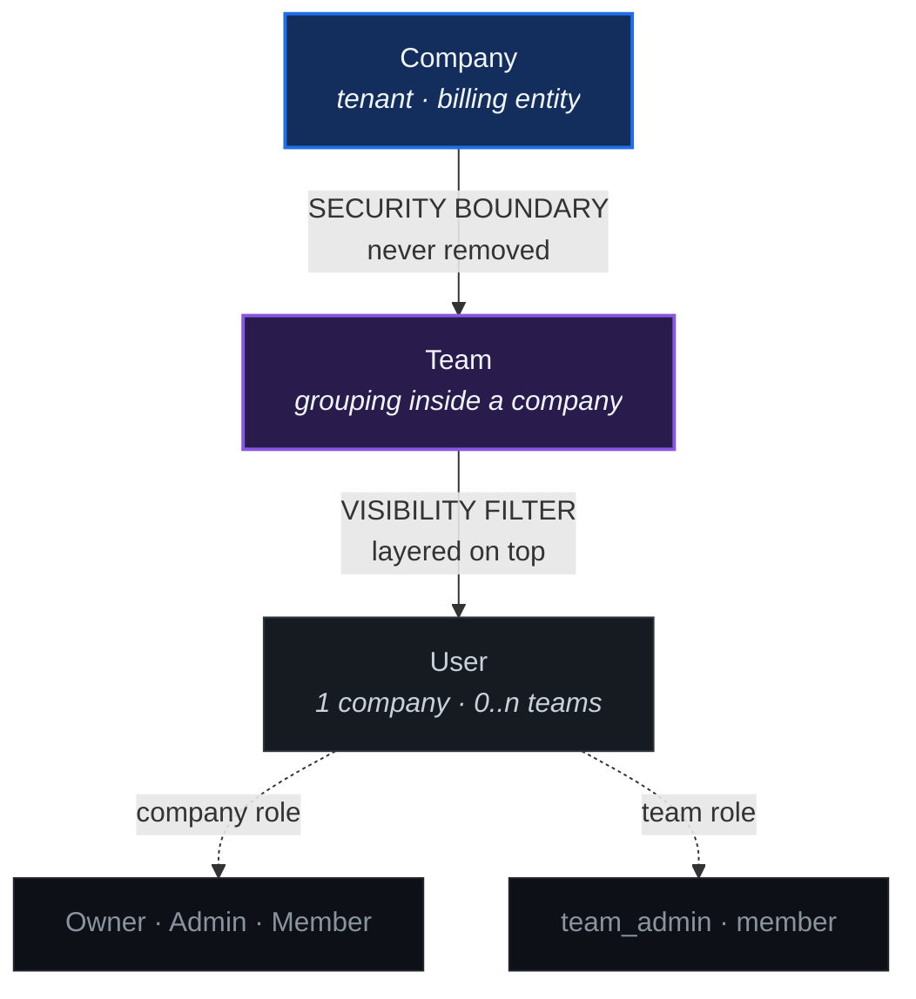
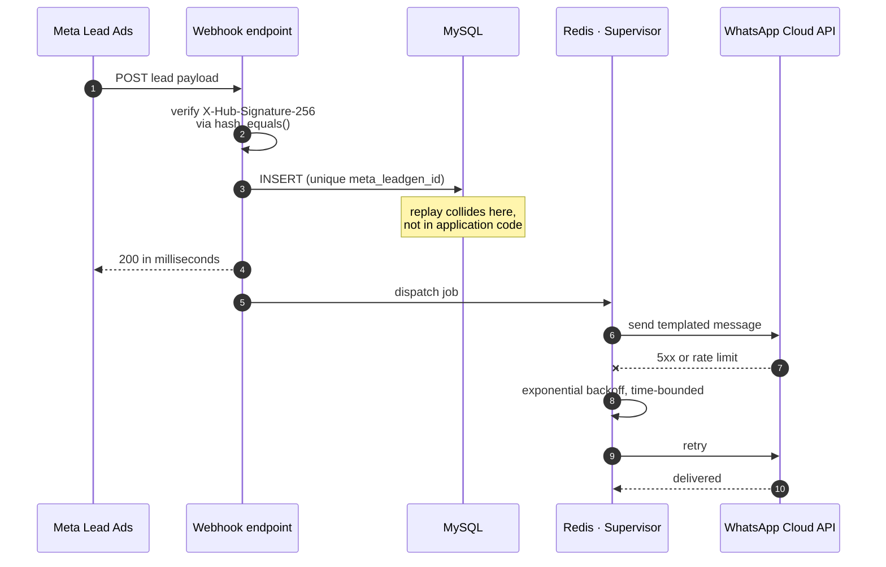

<div align="center">

# Adnan Haider

### Backend Engineer &nbsp;·&nbsp; Laravel &nbsp;·&nbsp; PHP 8.3 &nbsp;·&nbsp; Multi&#8209;tenant SaaS

Six years of PHP, most of it on the unglamorous half. The queue that has to drain.
The webhook that cannot return a 502. The migration that would have taken a table
lock at 4pm on a Friday.

I write the boring, load&#8209;bearing code, and the static analysis that keeps other
people from breaking it.

<a href="https://codebyadnan.tech"></a> <a href="https://www.linkedin.com/in/adnan-haider/"></a> <a href="https://regretindex.me"></a> <a href="mailto:adnanhaider0347@gmail.com"></a>

</div>

---

# Proposal SaaS

### Turning a delivered single&#8209;tenant product into a real multi&#8209;tenant one

I shipped this for one client: GrapesJS canvas, a ~900&#8209;line server renderer, headless&#8209;Chrome PDF export, cryptographic sealing, in&#8209;browser signature capture. It works. Now I am pulling the single&#8209;tenant assumptions out of it one at a time, which is turning out to be harder than building it was.

The editor was never the hard part. Tenancy is. Every B2B leak postmortem I have read comes down to the same thing: someone treated isolation as a query filter instead of a boundary the query cannot escape.



> [!IMPORTANT]
> `CompanyScope` applies **no filter at all** when no tenant resolves. That sounds like the bug. It is deliberate, so console commands and migrations still work, and it is safe for exactly one reason: `users.company_id` is `NOT NULL`. An authenticated user can never resolve to null and see everything. Make that column nullable and the whole design becomes a data leak.

### Five invariants I defend with tests, not comments

| Invariant | What breaks without it |
|:--|:--|
| **Scope narrows, never swaps** | Team visibility built by *replacing* the company scope instead of layering on it. This is the classic leak. |
| **Fails open, deliberately** | Console commands and migrations stop working. Safe only while `users.company_id` stays `NOT NULL`. |
| **Roles are per company** | Spatie's `team_foreign_key` points at `company_id`. Point it at `teams.id` and roles leak across tenants. |
| **Authorisation self&#8209;scopes** | `User::can()` binds to the user's own company. Otherwise every check inside a job or command silently returns `false`. |
| **Two locale axes** | `users.locale` is the sender's UI. `proposals.locale` is the signed document. A German agency sends an English proposal to a UK buyer. |

This one already bit me twice, in `defaultTeam()` and again in `provisionRoles()`:

```diff
- // Looks harmless. Returns an empty collection when another tenant is current,
- // which produces users with no team and no visibility. No error, no warning.
- $company->teams()->get();

+ // Team carries CompanyScope, so any walk of a company's children has to run
+ // inside that company's context, even when you already hold the model.
+ CompanyContext::for($company->id, fn () => $company->teams()->get());
```

      

<details>
<summary><b>The actual phase tracker</b> &nbsp;<i>(where this sits today)</i></summary>

<br/>

Phase 1 is not done until an isolation suite proves Company A cannot reach Company B's proposals, templates, settings, media, smart content, email templates, users or teams through *any* route. Nothing downstream starts before that gate passes.

- [x] `1a` Tenancy schema migrations
- [x] `1b` Models, `BelongsToCompany`, visibility scopes, factories
- [x] `1c` Global&#8209;singleton fixes (cache keys, unique constraints)
- [x] `1d` Roles, permissions, policies
- [ ] `1i` Internationalisation, dual&#8209;axis &nbsp;<sup>code done, ~110 admin strings left</sup>
- [ ] `1e` Public sign&#8209;up, registration links, invitations &nbsp;<sup>**in progress**</sup>
- [ ] `1f` Per&#8209;tenant credentials plus SSRF guard
- [ ] `1g` Cross&#8209;tenant isolation suite &nbsp;<sup>**Phase 1 gate**</sup>
- [ ] `1.5` Decoupling from the upstream billing system
- [ ] `2` Billing, plan limits, reminders
- [ ] `3` Approvals and multi&#8209;signer

**Debt I have written down rather than pretended away:** the PDF endpoint regenerates with headless Chrome on every download. Sealed proposals are immutable, so that is pure waste, and it becomes the dominant hosting cost the moment a free tier exists. It gets cached before launch, not after.

**Translation policy:** formatting works for all 25 locales, but reviewed strings ship for `en` and `de` only. A proposal is a quasi&#8209;legal document somebody signs. A mistranslated accept, decline or expiry clause is a dispute, not a typo, so machine translation does not go near the client&#8209;facing axis.

</details>

---

# Meta Lead Ads to WhatsApp

### Webhook ingestion that does not drop leads

Meta does not care about your queue depth. Return slowly enough, often enough, and it marks the endpoint unhealthy and throttles the campaign. So nothing does real work on the request thread.



**Two integrity gates, deliberately independent.** The signature check rejects forgeries. The unique index on `meta_leadgen_id` makes a replay a no&#8209;op at the database level. I want the second one in the schema rather than in a service class, because schemas do not get refactored around at 2am.

**Backoff is time&#8209;bounded, not attempt&#8209;bounded.** A provider outage should degrade throughput and then recover. It should not silently exhaust retries and drop a lead somebody paid for.

     

---

# [The Regret Index](https://regretindex.me)

### Solo founder. My architecture, my pager.

Log a decision, revisit it on a schedule, find out whether your instincts actually calibrate. Backed by Google Cloud for Startups and MongoDB for Startups.

Building it alone taught me more about cost than about code. Embeddings are cheap to call and expensive to call *badly*, and the difference is entirely in what you cache.

      

---

# Open source

Eight packages, **83 stars**, all PHP. Each one exists because I hit the problem on a real project, went looking for the fix, and did not find one that worked properly.

<table>
<tr>
<td width="50%" valign="top">

### [nexus-inventory](https://github.com/malikad778/nexus-inventory)

 

Stock sync for Laravel across Shopify, WooCommerce, Amazon and Etsy. The easy part is the webhooks. The real part is what happens when two channels sell the last unit inside the same second.

`Laravel 10-12` &nbsp;`Webhooks` &nbsp;`Job queues`

</td>
<td width="50%" valign="top">

### [php-sentinel](https://github.com/malikad778/php-sentinel)

 

Watches the JSON a third party actually sends you and infers its shape over time. When a field quietly disappears or changes type, you hear about it from this instead of from a customer.

`PHP 8.3+` &nbsp;`Schema drift` &nbsp;`MIT`

</td>
</tr>
<tr>
<td width="50%" valign="top">

### [Laravel-migration-guard](https://github.com/malikad778/Laravel-migration-guard)

 

Reads your migrations in CI and fails the build on the ones that take a table lock or drop a column with data behind it. Zero config. Rails has `strong_migrations`; Laravel did not.

`AST parser` &nbsp;`CI gate` &nbsp;`Zero config`

</td>
<td width="50%" valign="top">

### [wp-hook-check](https://github.com/malikad778/wp-hook-check)

 

Orphaned listeners, unheard hooks, misspelled action names. Finds all three by reading source, without ever bootstrapping WordPress, so it is fast enough to run on every commit.

`PHP CLI` &nbsp;`WordPress` &nbsp;`Static analysis`

</td>
</tr>
<tr>
<td width="50%" valign="top">

### [notification-center](https://github.com/malikad778/notification-center)

 

Multi&#8209;channel dispatch for Laravel 12. When a provider starts timing out the breaker trips and reroutes, instead of parking twenty workers on a dead endpoint until the queue backs up.

`Laravel 12` &nbsp;`Circuit breaker` &nbsp;`Telemetry`

</td>
<td width="50%" valign="top">

### [blade-access](https://github.com/malikad778/blade-access)

 

73 WCAG 2.1 AA rules for Blade and Livewire, aimed at the European Accessibility Act. Ships a baseline file, because a linter that turns a legacy codebase red on day one just gets switched off.

`WCAG 2.1 AA` &nbsp;`Baseline` &nbsp;`CI`

</td>
</tr>
<tr>
<td width="50%" valign="top">

### [ai-mcp](https://github.com/malikad778/ai-mcp)

 

Makes a WordPress site readable by AI agents. Semantic chunking, FAQ extraction, media and author indexing, `llms.txt` and an MCP manifest, all over REST.

`MCP` &nbsp;`WordPress` &nbsp;`REST`

</td>
<td width="50%" valign="top">

### [woocommerce-otp-auth-engine](https://github.com/malikad778/woocommerce-otp-auth-engine)

 

Gates OTP *before* the user row is written, so bots never create the account at all. Includes SMS pumping and AIT fraud defence, which is the bill most OTP plugins leave you to find out about.

`WooCommerce` &nbsp;`Fraud defence` &nbsp;`Multisite`

</td>
</tr>
</table>

---

# Stack

<table>
<tr><td valign="middle"><b>CORE</b></td><td></td></tr>
<tr><td valign="middle"><b>DATA</b></td><td></td></tr>
<tr><td valign="middle"><b>INFRA</b></td><td></td></tr>
<tr><td valign="middle"><b>FRONT</b></td><td></td></tr>
<tr><td valign="middle"><b>APIS</b></td><td></td></tr>
<tr><td valign="middle"><b>TEST</b></td><td></td></tr>
</table>

---

# The code itself

<div align="center">

  

<br/><br/>


</div>

### Language split across the eight packages, by source bytes


**PHP 87.1%** &nbsp;·&nbsp; Blade 6.6% &nbsp;·&nbsp; JavaScript 3.5% &nbsp;·&nbsp; CSS and HTML 2.8%

Measured across the eight packages, not every repo on the account. Counting everything puts JavaScript on top at 33.6%, which is just my portfolio site's vendored assets talking. The number that means something is the one over code other people run in their own CI.

---

# How I work

**A test that never disagrees with you is decoration.** Write the one that fails when the invariant breaks, not the one that passes today. In a multi&#8209;tenant system the tests worth having are the ones that go red the second somebody collapses two axes into one.

**Fail loudly at the boundary, gracefully in the middle.** Reject a malformed payload at ingestion, where it is cheap and you still have the context. The alternative is a half&#8209;written row three services deep that a customer finds for you next week.

**Write down the deviation and the reason.** Plans are wrong in places. Six months later the useful artefact is not the plan, it is knowing why the code went the other way and what would have to change for the original idea to work.

**Comments explain why. Code explains what.** If a block needs a comment to say what it does, rewrite the block. Save the comments for the constraints you cannot see from the syntax, like a port collision that presents as an auth error.

---

<div align="center">


### Laravel · PHP · multi&#8209;tenant SaaS · integration&#8209;heavy systems

Based in Pakistan, working remotely.

**[adnanhaider0347@gmail.com](mailto:adnanhaider0347@gmail.com)** &nbsp;·&nbsp; **[codebyadnan.tech](https://codebyadnan.tech)** &nbsp;·&nbsp; **[LinkedIn](https://www.linkedin.com/in/adnan-haider/)**

</div>
